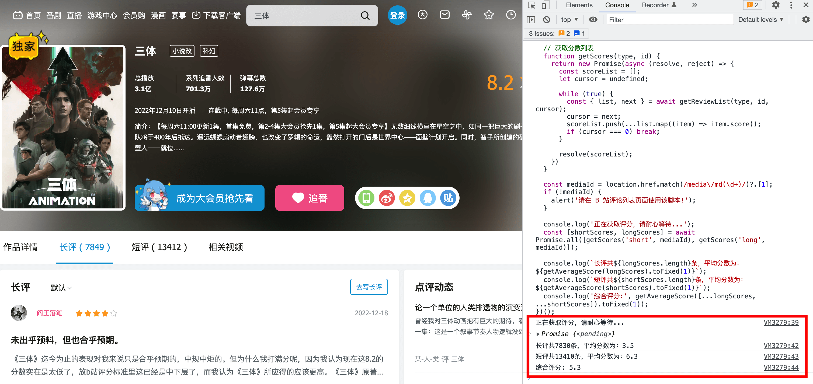

# 获取 [B 站（bilibili）](https://www.bilibili.com/) 动画、影视等作品的真实评分

## [背景](./backgroud.md)

## 使用方式
1. 首先需要进入相关作品的评分页面，然后打开浏览器的控制台；
2. 打开该目录下 `score.js` 文件，全选复制文件内容，粘贴到控制台中按回车等待执行结果即可；

以[《三体》](https://api.bilibili.com/pgc/review/short/list?media_id=4315402&ps=30&sort=0&cursor=81475573188861)为例，如下图所示:

> 通过接口获取的评论数量跟 B 站页面上显示的评论数量有点出入，不清楚是不是评论被删的原因。

## LICENSE
[MIT](./LICENSE)
